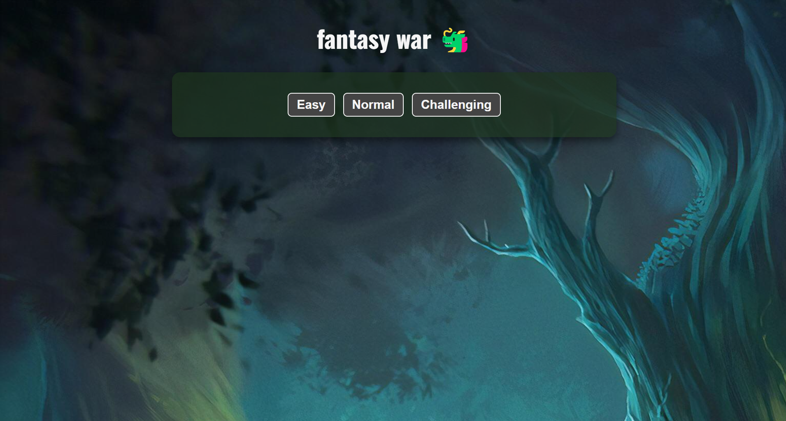
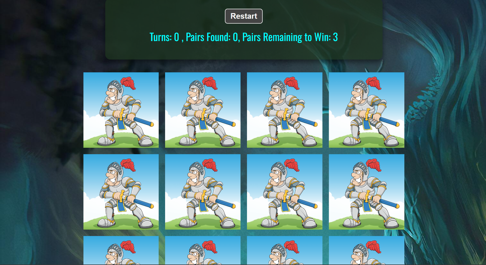
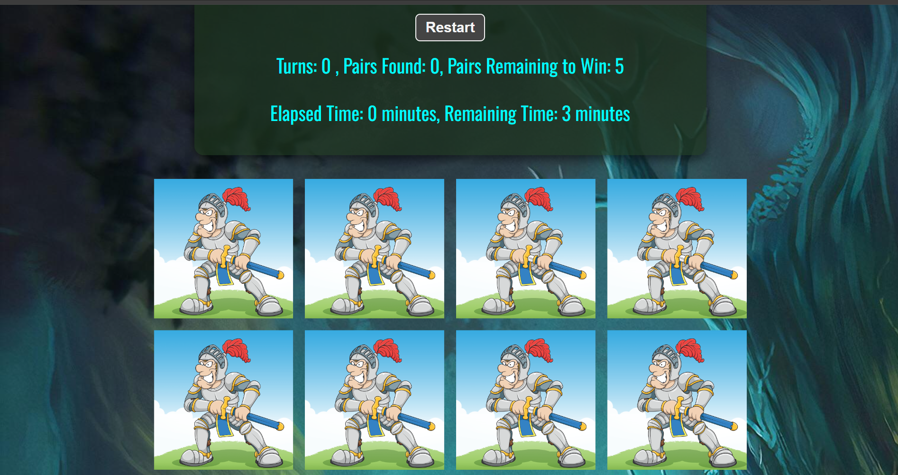

# Fantasy_Card

## Date: 14/8/2024

### By: Hussain Al Aradi

#### [Gmail](hussainaradi.ha@gmail.com) | [GitHub](https://github.com/HussainALAradi5) | [LinkedIn](https://www.linkedin.com/in/hussainalaradi/)

---

### **_Description_**

#### this project is small and nice game to experience also it will deliver nice UX & UI and it compatible with all different ages.
#### [game](https://fantasy_cards.surge.sh/)
---

### **_Technologies Used_**

- JS
- React(FrameWork)
- Node js (Runtime-evnironement)
- CSS(for style)
- HTML

---

### **_Getting Started_**

##### just play the game and enjoy it

---

### **_Screenshots_**

##### intro

#### showcase:
##### 1- easy 
##### 2-normal 
#### animated showcase:
.gif)

### **_Future Updates_**

- [x] improve UI
- [ ] add more cards
- [ ] improve difficulties 

---

### **_Credits_**

##### google for images,

##### inspired by:the traditional  card memroy game

---
